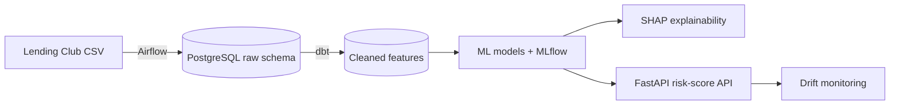

# Loan Default Risk Prediction Pipeline

An end-to-end data engineering and machine learning pipeline that predicts the probability that a borrower will default on a loan, built on ~2.2 million real loans from Lending Club (2007–2018).

## Architecture



## Roadmap

- [x] **Step 1 – Ingestion:** Airflow DAG loads the raw file into PostgreSQL with validation checks
- [ ] **Step 2 – Transformation:** dbt models for cleaning, typing, and feature engineering
- [ ] **Step 3 – Modeling:** Logistic Regression, Random Forest, and XGBoost with class-imbalance handling, tracked in MLflow
- [ ] **Step 4 – Explainability:** SHAP analysis of what drives default risk
- [ ] **Step 5 – Serving:** FastAPI endpoint packaged with Docker
- [ ] **Step 6 – Monitoring and CI/CD:** data drift reports with Evidently, tests with GitHub Actions

## Key design decisions

- **No data leakage.** Only fields known when a loan is approved are loaded. Payment fields such as `total_pymnt` exist only after a loan ends and would leak the outcome into the model.
- **Raw layer stored as text.** The raw table is an exact copy of the source; all type casting happens in dbt, so bad values never break ingestion.
- **Chunked, repeatable loads.** The file is read in 100k-row chunks and every run is a full refresh, so re-running the DAG never creates duplicates.

## Running it locally

**Requirements:** Docker Desktop and Python 3.11+.

1. **Download the data.** Get `accepted_2007_to_2018Q4.csv.gz` from the [Lending Club dataset on Kaggle](https://www.kaggle.com/datasets/wordsforthewise/lending-club) and put it in `data/raw/`.

2. **Start Postgres and Airflow.**
   ```bash
   docker compose up -d
   ```

3. **Log in to Airflow** at http://localhost:8080. The username is `admin`; get the password with:
   ```bash
   docker compose exec airflow cat /opt/airflow/standalone_admin_password.txt
   ```

4. **Run the pipeline.** Turn on the `ingest_lending_club` DAG and click ▶ to trigger it.

5. **Check the result.**
   ```bash
   docker compose exec warehouse psql -U loans -d warehouse -c "SELECT COUNT(*) FROM raw.lending_club_loans;"
   ```

### Faster development runs

Create a 100k-row sample, then change `RAW_DATA_PATH` in `docker-compose.yml` to `/opt/airflow/data/raw/sample_loans.csv`:

```bash
python -m src.ingestion.make_sample --rows 100000
```

## Tests

```bash
python -m venv .venv && source .venv/bin/activate
pip install -r requirements.txt
pytest
```

## Project structure

```
├── dags/                  # Airflow DAGs
├── src/ingestion/         # Loading and sampling logic
├── tests/                 # Unit tests
├── data/raw/              # Source data (not committed)
└── docker-compose.yml     # Postgres + Airflow
```
