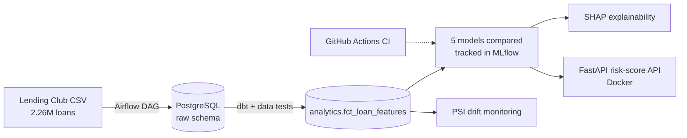
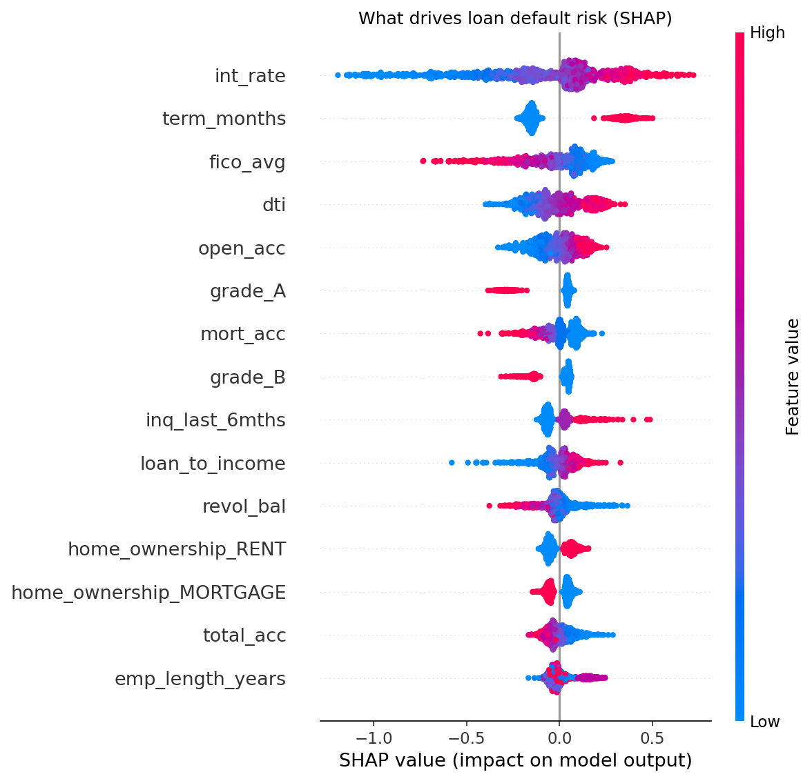
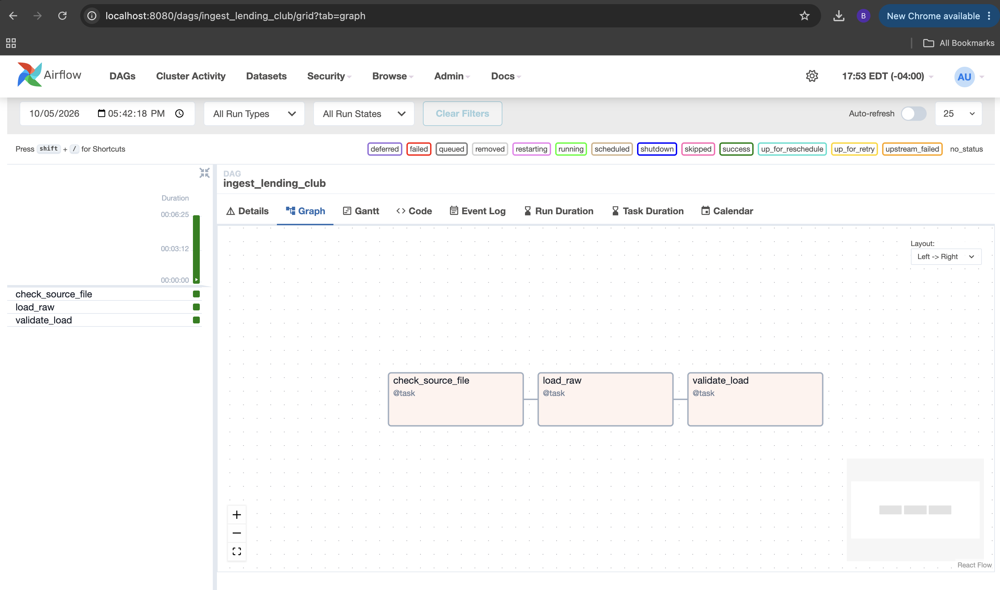
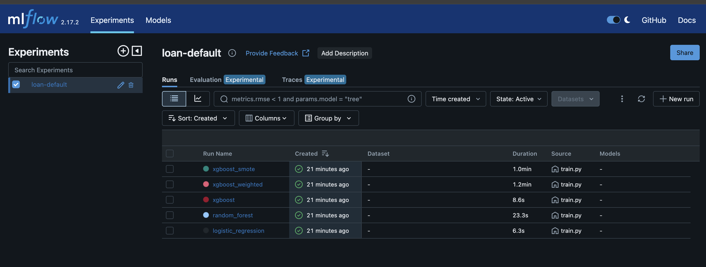
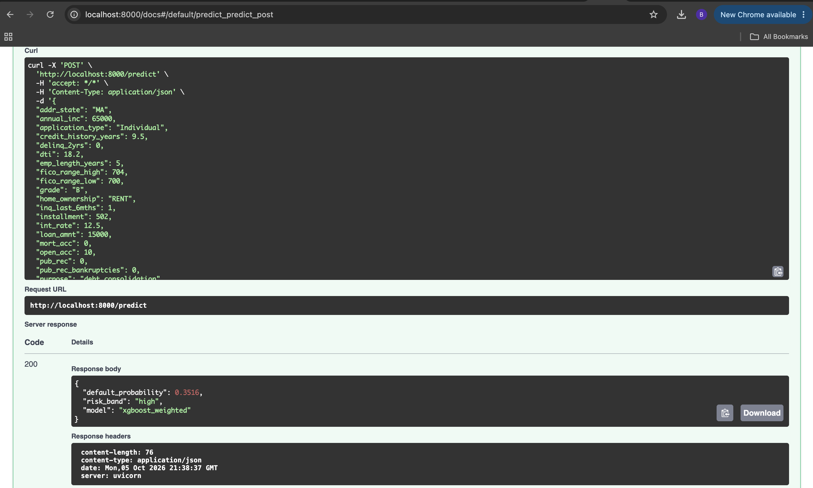

# Loan Default Risk Prediction Pipeline


An end-to-end data engineering and machine learning pipeline that predicts the probability that a borrower will default, built on **2.26 million real Lending Club loans (2007–2018)**. It covers the full lifecycle: orchestrated ingestion, tested SQL transformations, model comparison with experiment tracking, explainability, a containerized scoring API, drift monitoring, and CI.

## Architecture



## What each step does

| Step | What | Tools |
|---|---|---|
| 1. Ingestion | Loads 2.26M loans into PostgreSQL in ~6.5 minutes with chunked reads, schema checks and row-count validation | Airflow, PostgreSQL, Docker |
| 2. Transformation | Cleans and types raw text, keeps only finished loans, builds the `is_default` label, runs data tests (uniqueness, nulls, accepted values) | dbt |
| 3. Modeling | Compares Logistic Regression, Random Forest and three XGBoost variants (no handling, class weighting, SMOTE) on ROC-AUC, PR-AUC and KS | scikit-learn, XGBoost, imbalanced-learn, MLflow |
| 4. Explainability | Shows which features push default risk up or down | SHAP |
| 5. Serving | REST endpoint that scores a loan application and returns a risk band | FastAPI, Docker |
| 6. Monitoring & CI | Population Stability Index (PSI) drift report between older and newer loans; tests run on every push | GitHub Actions, pytest |

## Results

Trained on a stratified sample of 500,000 of the 1,348,099 finished loans (20.0% default rate), evaluated on a held-out 20% test set.

| Model | Imbalance handling | ROC-AUC | PR-AUC | KS |
|---|---|---|---|---|
| **XGBoost (best)** | class weighting | **0.720** | **0.391** | 0.319 |
| XGBoost | none | 0.720 | 0.391 | 0.320 |
| XGBoost | SMOTE | 0.712 | 0.380 | 0.309 |
| Random Forest | class weighting | 0.709 | 0.377 | 0.302 |
| Logistic Regression | class weighting | 0.708 | 0.370 | 0.303 |

**Takeaways**
- Gradient boosting beat the linear baseline, and class weighting matched or beat SMOTE while training about 7x faster.
- A ROC-AUC around 0.72 is realistic for this dataset when only application-time data is used; much higher scores on Lending Club usually come from leaking post-loan payment columns.
- Top risk drivers (SHAP): interest rate, loan term, FICO score, debt-to-income ratio and number of open accounts.
- No feature showed significant drift (PSI > 0.25) between loans issued up to 2015 and after.
- Scores are best read as a risk ranking: class weighting inflates raw probabilities, so probability calibration is a natural next step.

Full details: [`reports/model_comparison.md`](reports/model_comparison.md) · [`reports/drift_report.md`](reports/drift_report.md)

### What drives default risk



## Screenshots

**Airflow ingestion DAG** loading 2.26M loans



**MLflow** comparing the five models



**FastAPI** scoring a loan application



## Key design decisions

- **No data leakage.** Only fields known when a loan is approved are used. Payment fields such as `total_pymnt` exist only after a loan ends and would leak the outcome into the model.
- **Only finished loans are labeled.** Loans that are still `Current` have no final outcome, so they are excluded from training rather than wrongly counted as "not defaulted."
- **Imbalanced target handled explicitly.** Only a minority of loans default, so class weighting and SMOTE are compared against no handling, and models are judged on PR-AUC and KS (the credit-industry standard), not accuracy.
- **No training/serving skew.** Training and the API share one feature module (`src/features/build.py`), so a loan is transformed identically in both places.
- **PSI for drift.** PSI is the metric banks use to monitor credit models: below 0.10 is stable, above 0.25 signals retraining.
- **Raw layer stored as text; repeatable loads.** All type casting happens in dbt so bad values never break ingestion, and every run is a full refresh, so re-runs never create duplicates.

## Running it locally

**Requirements:** Docker Desktop (8 GB RAM recommended).

1. **Download the data.** Get `accepted_2007_to_2018Q4.csv.gz` from the [Lending Club dataset on Kaggle](https://www.kaggle.com/datasets/wordsforthewise/lending-club) and put it in `data/raw/`.

2. **Start Postgres and Airflow, then run ingestion.**
   ```bash
   docker compose up -d
   ```
   Log in at http://localhost:8080 (username `admin`; password from `docker compose exec airflow cat /opt/airflow/standalone_admin_password.txt`), then turn on and trigger the `ingest_lending_club` DAG.

3. **Run steps 2–6 with one command.**
   ```bash
   bash run_pipeline.sh
   ```

4. **Try it.**
   - API docs and live testing: http://localhost:8000/docs (use the example request on `/predict`)
   - MLflow experiment tracking: http://localhost:5001

## Tests

```bash
pip install -r requirements.txt
pytest -v
```

## Project structure

```
├── dags/                  # Airflow ingestion DAG
├── dbt/                   # dbt project: staging + mart models with data tests
├── src/
│   ├── ingestion/         # Chunked, validated raw load
│   ├── features/          # Shared feature engineering (training + API)
│   ├── models/            # Training, model comparison, SHAP
│   ├── monitoring/        # PSI drift report
│   └── api/               # FastAPI scoring service
├── tests/                 # Unit tests (run in CI)
├── reports/               # Generated results
├── run_pipeline.sh        # Runs steps 2–6
└── docker-compose.yml     # Postgres, Airflow, dbt, training jobs, API, MLflow
```
